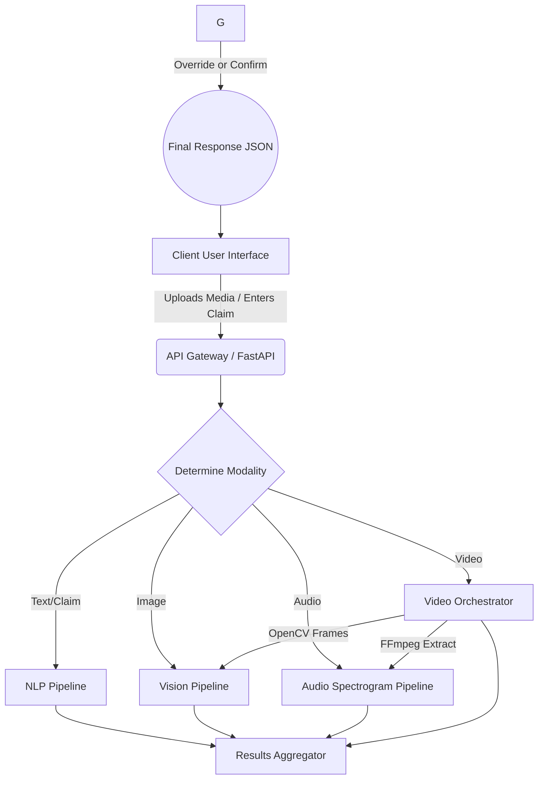
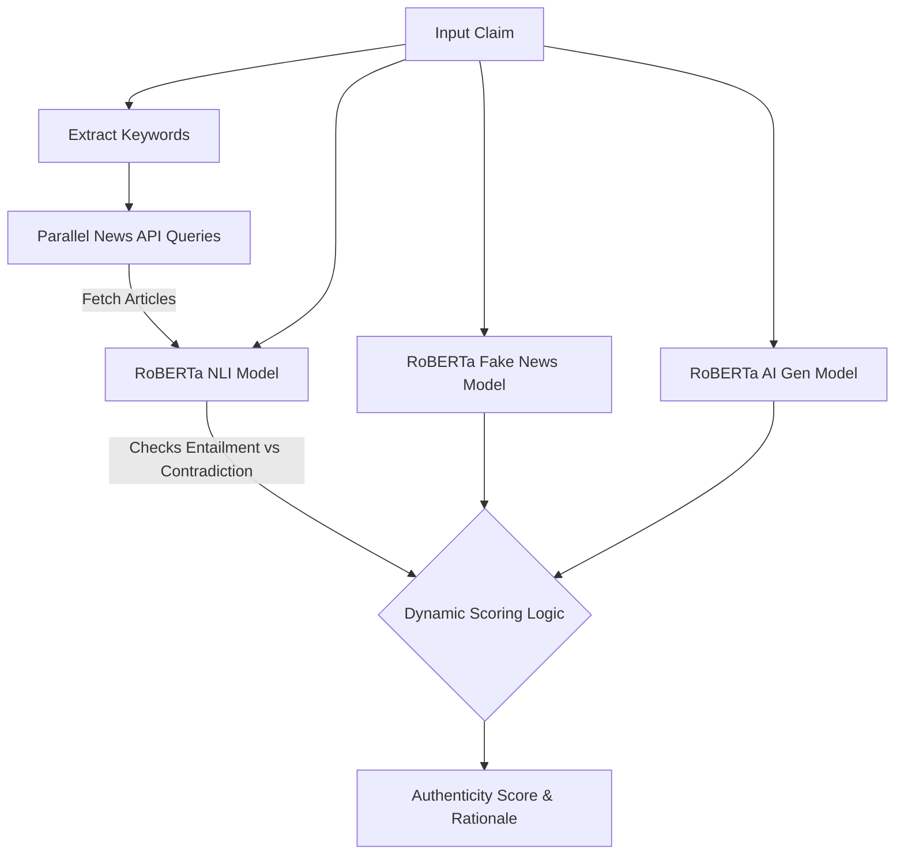
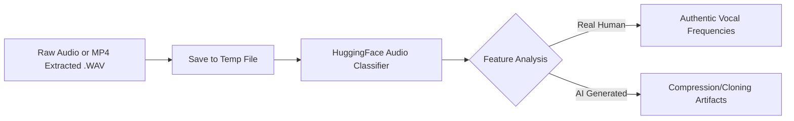

# TruthLens AI: Multi-Modal Misinformation & Deepfake Detection Platform


TruthLens AI is a production-grade AI platform designed to detect misinformation and synthetic media across **Text, Images, Audio, and Video**. The platform utilizes state-of-the-art open-source Hugging Face models combined with a dynamic verification layer to provide highly accurate authenticity analyses.

---

## 📑 Table of Contents

- [Overview](#overview)
- [Architecture Flowchart](#architecture-flowchart)
- [Modality Breakdown & AI Models Used](#modality-breakdown--ai-models-used)
  - [1. Text Analysis (Misinformation & AI Generation)](#1-text-analysis-misinformation--ai-generation)
  - [2. Image Analysis (Vision Deepfake Detection)](#2-image-analysis-vision-deepfake-detection)
  - [3. Audio Analysis (Voice Cloning Detection)](#3-audio-analysis-voice-cloning-detection)
  - [4. Video Orchestration (Multi-modal Aggregation)](#4-video-orchestration-multi-modal-aggregation)
- [The Hidden Verification Layer (Gemini)](#the-hidden-verification-layer-gemini)
- [Development Setup](#development-setup)
- [Deployment Guide](#deployment-guide)

---

## Overview

TruthLens AI accepts user-uploaded media or text claims and passes them through a sophisticated processing pipeline. Instead of relying on a single monolithic model, it routes the payload to **specialized analysis engines** based on the modality. Each engine returns an authenticity score, confidence metrics, and an explainable rationale, which is displayed on a premium glassmorphic UI.

---

## Architecture Flowchart

Below is the high-level architecture of how requests are processed within TruthLens AI.



---

## Modality Breakdown & AI Models Used

### 1. Text Analysis (Misinformation & AI Generation)

The text analysis pipeline is the most complex, utilizing a multi-faceted approach to verify claims: Semantic Search + AI Text Detection + Disinformation Classification + Zero-Shot Natural Language Inference (NLI).

**Models & APIs Used:**

- **Fake News Classifier:** `hamzab/roberta-fake-news-classification` (Identifies sensational/fake tone).
- **AI Text Detector:** `roberta-base-openai-detector` (Detects if the text was LLM-generated).
- **NLI Classifier:** `roberta-large-mnli` (Checks logical entailment/contradiction against real-world news).
- **News APIs:** `Wikipedia`, `NewsAPI`, `GNews`, `MediaStack`, `TheNewsAPI`.

**Process Flow:**



_The text engine heavily weights the NLI cross-checking against trusted sources. If a user inputs a fake claim that contradicts live news feeds, the fake score spikes to 95%+._

### 2. Image Analysis (Vision Deepfake Detection)

The Image Engine looks for reverse synthesis artifacts directly in pixels.

**Models Used:**

- **Vision Transformer (ViT):** `prithivMLmods/Deep-Fake-Detector-v2-Model`

**Process Flow:**

- Converts images to RGB using `PIL`.
- Feeds raw image embeddings into the ViT sequence pipeline.
- Extracts `Realism` vs `Deepfake` probabilities.
- Analyzes results. If realism > 85%, it notes natural camera sensor noise. If < 40%, it identifies AI diffusion/GAN artifacts.

### 3. Audio Analysis (Voice Cloning Detection)

The Audio Engine performs spectrogram-style frequency feature detection to catch synthetic voice cloning tools (like ElevenLabs).

**Models Used:**

- **Audio Classifier:** `mo-thecreator/Deepfake-audio-detection`

**Process Flow:**



### 4. Video Orchestration (Multi-modal Aggregation)

Because "Video" deepfakes can manipulate _just_ the audio, _just_ the visuals, or _both_, we process them concurrently.

**Tools Used:**

- `FFmpeg` for audio extraction.
- `OpenCV` (cv2) for frame extraction.

**Process Flow:**

1. A video buffer is written to disk.
2. `FFmpeg` extracts the `.wav` audio track and ships it to the **AudioDetector**.
3. `OpenCV` samples up to **3 frames** (10%, 50%, 90% timeline marks) and ships them to the **ImageDetector**.
4. Uses `asyncio.gather` for blazing fast concurrent assessment.
5. Scores are aggregated (Weighting: **60% Visual, 40% Audio**).

---

## Development Setup

### 1. Backend (FastAPI)

```bash
cd backend
python -m venv venv
source venv/bin/activate
pip install -r requirements.txt
```

**Environment Variables:**
Create a `.env` in `backend/`

```env
NEWS_API_KEY=your_key_here
# MEDIASTACK_API_KEY, etc.
```

**Run Server:**

```bash
uvicorn main:app --reload --host 0.0.0.0 --port 8000
```

### 2. Frontend (React / Vite)

```bash
cd frontend
npm install
npm run dev
```

---

## Deployment Guide

We highly recommend splitting the hosting into two services to support the heavy RAM requirements for the NLP models.

### 1. Deploying the Backend (Hugging Face Spaces)

1. Navigate to **Hugging Face > Spaces > Create New Space**.
2. Select **Docker (Blank)** template. Use the Free Build tier (16GB RAM).
3. Upload ALL contents from your `backend/` folder into the Space exactly as they are. (Hugging Face will automatically find the `Dockerfile` we provided and build it).
4. Note your running Space API URL.

### 2. Deploying the Frontend (Vercel)

1. Push your `frontend/` folder to a GitHub repository.
2. Import this repo into **Vercel**.
3. _Crucial:_ In Vercel Environment Variables, set `VITE_API_URL` to your Hugging Face Space URL. _(e.g., `https://yourusername-truthlens-backend.hf.space/api/v1/detect`)_
4. Hit Deploy!

Your platform is now live 24/7 worldwide fully automated.
